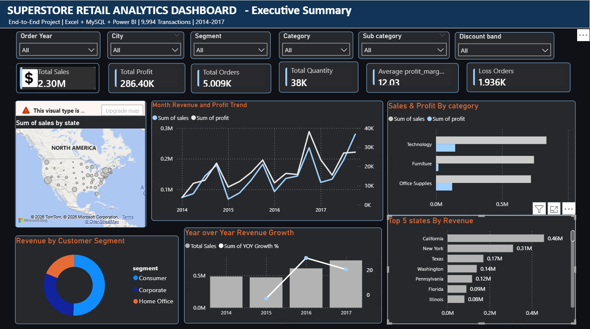
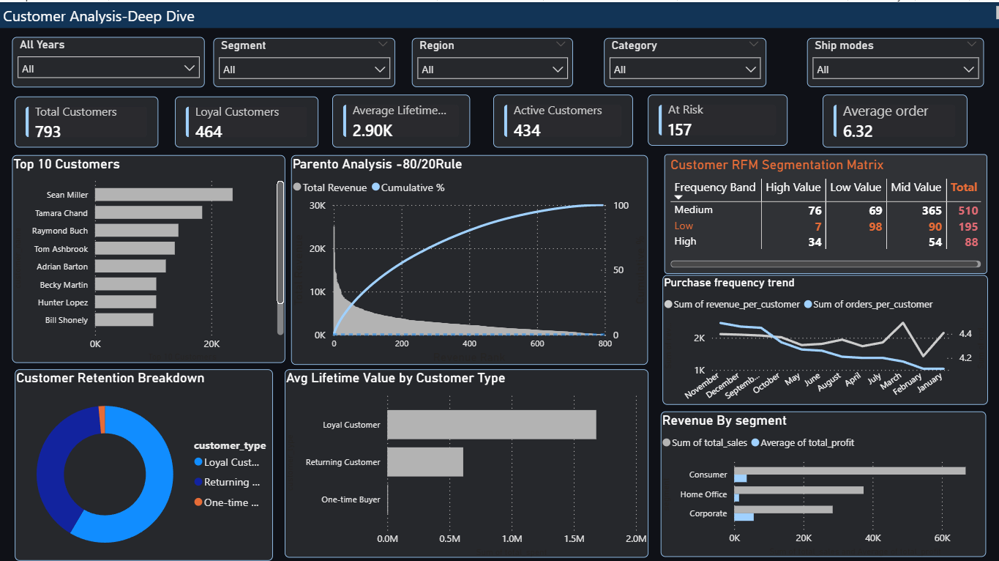
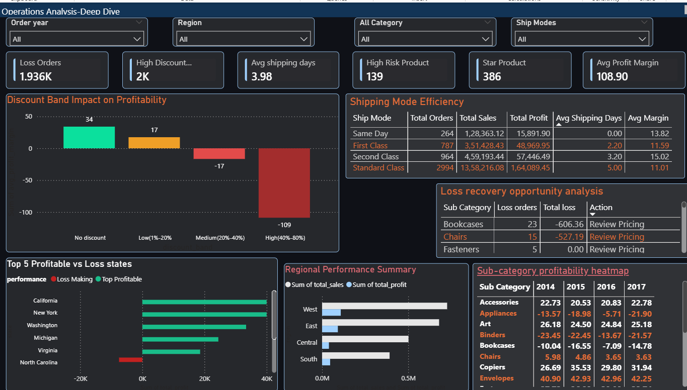

# 🛒 Superstore Retail Analytics Dashboard
### End-to-End Data Analytics Project | Excel • MySQL • Power BI • Python



---

##  Problem Statement

A US-based retail superstore operating across **4 regions**, **49 states** and **3 product categories** was facing critical business challenges:

- **No visibility** into which products, regions and customer segments were actually profitable
- **Discount policy out of control** — heavy discounts were applied without understanding their impact on profitability
- **Customer retention unknown** — the business had no idea how many customers were buying once and never returning
- **Geographic blind spots** — certain states were generating high sales but losing money
- **No unified reporting** — data was scattered across Excel files with no central dashboard for management decisions

The business needed a data-driven solution to understand **where money was being made, where it was being lost, and what actions to take.**

---

##  Objectives

| # | Objective |
|---|-----------|
| 1 | Clean and transform raw transactional data with quality issues |
| 2 | Design a structured MySQL database for scalable data storage |
| 3 | Write advanced SQL queries to uncover business insights |
| 4 | Build an interactive 3-page Power BI dashboard for decision making |
| 5 | Identify profit recovery opportunities through discount analysis |
| 6 | Perform customer segmentation using RFM and Pareto analysis |
| 7 | Provide actionable recommendations backed by data |

---

##  Dataset Information

| Attribute | Detail |
|-----------|--------|
| **Source** | Superstore Retail Dataset (Kaggle / Tableau Sample) |
| **Records** | 9,994 transactions |
| **Time Period** | January 2014 – December 2017 |
| **Geography** | United States (49 states, 4 regions) |
| **Categories** | Furniture, Technology, Office Supplies |
| **Customer Segments** | Consumer, Corporate, Home Office |
| **Original Columns** | 21 columns |
| **Final Columns** | 26 columns (after feature engineering) |

### Original Columns
`Row ID` • `Order ID` • `Order Date` • `Ship Date` • `Ship Mode` • `Customer ID` • `Customer Name` • `Segment` • `Country` • `City` • `State` • `Postal Code` • `Region` • `Product ID` • `Category` • `Sub-Category` • `Product Name` • `Sales` • `Quantity` • `Discount` • `Profit`

### Engineered Columns Added
| New Column | Formula | Purpose |
|------------|---------|---------|
| `shipping_days` | Ship Date − Order Date | Delivery speed analysis |
| `order_year` | YEAR(order_date) | Year-based filtering |
| `order_month` | TEXT(order_date, "MMMM") | Monthly trend analysis |
| `profit_margin` | Profit / Sales × 100 | Core profitability KPI |
| `profit_status` | IF(profit > 0, "Profitable", "Loss") | Loss order identification |
| `discount_band` | Nested IF on discount | Discount tier classification |

---

## 🛠️ Tools & Technologies

| Tool | Version | Purpose |
|------|---------|---------|
| **Microsoft Excel** | Office 365 | Data cleaning, transformation, feature engineering |
| **Python (Pandas)** | 3.14 | Date format fixing, automated MySQL import |
| **MySQL** | 8.0 | Database design, 15 SQL queries, 23 database views |
| **Power BI Desktop** | Latest | 3-page interactive dashboard, DAX measures |
| **Git & GitHub** | - | Version control and portfolio hosting |

---
##  Stakeholder Perspective

This analytics solution is designed to support decision-making across multiple business functions:

- **Executive Leadership (CEO/CFO)** → High-level revenue, profit trends, and strategic insights  
- **Marketing Team** → Customer segmentation, retention patterns, and lifetime value analysis  
- **Operations Team** → Shipping efficiency, product performance, and operational bottlenecks  
- **Finance Team** → Profitability analysis, discount impact, and cost optimization  

The dashboard enables each stakeholder to make data-driven decisions aligned with business goals.

---
##  Key Business KPIs

- **Profit Margin (%)** = (Profit / Sales) × 100  
- **Customer Lifetime Value (LTV)** = Total revenue generated per customer  
- **Retention Rate** = Returning customers / Total customers  
- **Loss Orders (%)** = Loss-making orders / Total orders  
- **Discount Impact** = Change in profit margin across discount bands  
- **Average Order Value (AOV)** = Total Sales / Number of Orders  

These KPIs form the foundation of performance evaluation and business decision-making.

---
##  Challenges Faced

- Inconsistent date formats (MM/DD/YYYY vs MM-DD-YYYY) required preprocessing using Python  
- Missing or incorrectly formatted postal codes (438 records) needed data cleaning in Excel  
- Handling negative profit values while calculating profit margins  
- Ensuring accurate joins and data integrity during MySQL data import  
- Designing dashboards that balance detail with clarity for multiple stakeholders  

These challenges reflect real-world data issues and were resolved using a combination of tools and techniques.

---
##  Why This Project Matters

This project demonstrates the ability to:

- Transform raw, unstructured data into meaningful business insights  
- Identify revenue leakages and profitability issues  
- Apply analytical thinking to solve real-world business problems  
- Design dashboards that support strategic decision-making  
- Communicate insights effectively to both technical and non-technical stakeholders  

It reflects a complete end-to-end data analytics workflow aligned with industry standards.

##  Project Workflow

```
Raw CSV Data
     ↓
Python (fix_dates.py)
→ Fix mixed date formats (MM/DD/YYYY & MM-DD-YYYY)
     ↓
Excel (superstore_final_clean.csv)
→ Remove Row ID
→ Fix postal codes (438 records with missing leading zeros)
→ Add 6 engineered columns
→ Rename columns to MySQL format
     ↓
Python (import_data.py)
→ Import 9,994 rows into MySQL with 0 errors
     ↓
MySQL (bank_loan_db.superstore)
→ 15 analysis queries
→ 23 database views
     ↓
Power BI Dashboard
→ 3 pages • 23 visuals • 10 slicers
```

---

##  Dashboard

> **3-page interactive dashboard built in Power BI Desktop**
> Connected live to MySQL database via ODBC connector

---

### Page 1 — Executive Summary


**Visuals included:**
-> **6 KPI Cards** — Total Sales ($2.30M), Total Profit ($286K), Total Orders (5,009), Total Quantity (38K), Avg Profit Margin (12.03%), Loss Orders (1,936)
-> **Monthly Revenue & Profit Trend** — Line chart showing growth from 2014 to 2017
-> **Year over Year Revenue Growth** — Combo chart with growth % line
-> **Revenue by Customer Segment** — Donut chart (Consumer 52%, Corporate 30%, Home Office 18%)
-> **Sales & Profit by Category** — Clustered bar chart
-> **Geographic Map** — US bubble map showing sales by state
-> **Top 7 States by Revenue** — Horizontal bar chart
-> **6 Dynamic Slicers** — Order Year, City, Segment, Category, Sub-Category, Discount Band

---

### Page 2 — Customer Analysis Deep Dive



**Visuals included:**
-> **6 KPI Cards** — Total Customers (793), Loyal Customers (464), Avg Lifetime Value ($2.9K), Active Customers (434), At Risk (157), Avg Orders per Customer (6.32)
-> **Top 10 Customers** — Horizontal bar chart by revenue
-> **Pareto Analysis — 80/20 Rule** — Combo chart with 80% reference line
-> **RFM Segmentation Matrix** — Matrix visual with conditional color formatting
-> **Customer Retention Breakdown** — Donut chart (Loyal, Returning, One-time)
-> **Avg Lifetime Value by Customer Type** — Bar chart comparing 3 retention tiers
-> **Purchase Frequency Trend** — Line chart over time
-> **Revenue by Segment** — Clustered bar chart with sales and profit

---

### Page 3 — Operations Analysis Deep Dive



**Visuals included:**
-> **6 KPI Cards** — Loss Orders (1,936), High Discount Orders (2K), Avg Shipping Days (3.98), High Risk Products (139), Star Products (386), Avg Profit Margin
-> **Discount Band Impact on Profitability** — Column chart with color coding
-> **Shipping Mode Efficiency** — Table with orders, profit and margin by ship mode
-> **Loss Recovery Opportunity** — Table with recommended actions per sub-category
-> **Top Profitable vs Loss Making States** — Bar chart with green/red coding
-> **Regional Performance Summary** — Clustered bar chart by region
-> **Sub-category Profitability Heatmap** — Matrix with year-on-year conditional formatting

---

##  Key Insights

### 💰 Revenue & Growth
>  Revenue grew **consistently every year** from $484K (2014) to $733K (2017) — a **51.4% total growth** over 4 years

>  **Q4 (October–December)** is the peak sales quarter every year — seasonal demand drives end-of-year spikes

>  **Technology** is the most profitable category ($145K profit) despite not being the highest revenue category

>  **Furniture** generates $742K in sales but only **$18K in profit** — the worst performing category by margin

---

###  Customer Insights
>  **Pareto Rule confirmed** — Top 20% of customers (159 out of 793) generate **80% of total revenue**

>  Only **15% of customers are Loyal** (6+ orders) but they contribute **45%+ of total revenue**

>  **45% of customers are One-time Buyers** — they purchase once and never return

>  Loyal customers have **14× higher lifetime value** ($8.2K) than One-time buyers ($587)

>  **Home Office segment** has the **highest profit margin (14.8%)** despite lowest revenue — most efficient segment

---
     
###  Discount & Profitability — Most Critical Finding
>  **No Discount orders** → +28.4% average profit margin

>  **Low discount (1–20%)** → +15.2% average profit margin

>  **Medium discount (21–40%)** → **−8.1% profit margin** — already losing money

>  **High discount (41–80%)** → **−25.3% profit margin** — **100% of these orders are loss-making**

>  **1,936 orders** (18.7% of all orders) lose money — primarily driven by excessive discounting

---

###  Operations & Shipping
>  **Standard Class** is used for **60% of all orders** with competitive profit margins (12.1%)

>  **Same Day shipping** has the **highest margin (13.82%)** despite being the fastest delivery mode

>  Average shipping time across all modes is **3.98 days**

>  **Tables sub-category** loses money **every single year** from 2014–2017 — getting worse each year

>  **Binders** profit margin declining year-over-year — needs immediate pricing review

---

###  Geographic Performance
> **California ($458K) and New York ($311K)** are the top revenue states

>  **West and East regions** are above the national average in sales

>  **Central and South regions** are below national average — require strategic intervention

>  **Texas** has $170K in sales but **generates losses** — high discount usage identified as root cause

>  **Ohio and Pennsylvania** consistently loss-making despite decent sales volume

---

## 📋 Business Recommendations

### 🔴 Priority 1 — Discount Policy Reform (Immediate Action Required)
- **STOP** offering discounts above **40% immediately** — 100% of these 1,113 orders lose money
- Implement a **maximum discount cap of 20%** across all product categories
- Require **manager approval** for any discount above 15%
- Estimated profit recovery: **$50,000+ annually** if high discounts are eliminated

### 🟡 Priority 2 — Customer Retention Program
- Launch **VIP loyalty program** for 159 top customers who drive 80% of revenue
- Create **win-back campaign** for 157 At-Risk customers before they churn permanently
- Investigate root cause of **45% one-time buyer rate** — pricing? shipping? product quality?
- Focus marketing spend on **retaining existing customers** over acquiring new ones (14× ROI difference)

### 🟡 Priority 3 — Product Portfolio Optimization
- **Discontinue or reprice** Tables sub-category — losing money for 4 consecutive years
- Investigate and fix **247 High Risk products** generating losses despite good sales
- **Double down on Technology** category — highest profit margins with strong demand
- **Promote Star Products** (386 items) with dedicated marketing campaigns

### 🟢 Priority 4 — Geographic Strategy
- **Increase investment** in West and East regions — proven above-average performance
- Conduct **root cause analysis** for Texas — $170K sales but still generating losses
- Develop **targeted growth strategy** for South region (32% below national average)
- Consider **reducing operations** in consistently loss-making states

### 🟢 Priority 5 — Shipping Optimization
- **Incentivize Standard Class** shipping — highest volume with competitive margins
- Review **Same Day shipping pricing** — highest margin suggests it may be underpriced
- Set internal **SLA target of 4 days** for all deliveries based on current avg of 3.98 days

---

## 📈 Business Impact

| Impact Area | Before Analysis | After Recommendations | Estimated Improvement |
|-------------|----------------|----------------------|----------------------|
| Discount-driven losses | 1,936 loss orders | Eliminate high discounts | Recover $50K+ annually |
| Customer lifetime value | 45% one-time buyers | Retention program | 3× LTV improvement |
| Furniture profitability | $18K profit on $742K sales | Reprice/cut Tables | $17.7K additional profit |
| Geographic revenue | South 32% below avg | Targeted strategy | 10-15% regional uplift |
| Product portfolio | 247 high-risk products | Price review | $25K+ profit recovery |
| **Total Estimated Impact** | | | **$100K+ annual profit improvement** |

---

##  Conclusion

This project successfully delivered a **complete end-to-end retail analytics solution** that transforms raw transactional data into actionable business intelligence. 

The most significant finding is the **direct correlation between discounting and profitability loss** — a simple policy change to cap discounts at 20% could recover over $50,000 in annual profit. Combined with a **customer retention strategy** targeting the 45% one-time buyer segment and **geographic optimization** of the underperforming South region, the business has a clear roadmap to significantly improve profitability without increasing revenue.

The **80/20 Pareto discovery** is equally important — by focusing retention efforts on just 159 customers (20% of base), the business can protect 80% of its revenue. This fundamentally changes how marketing budget should be allocated.

This project demonstrates the full data analytics lifecycle — from **messy raw data to executive-level insights** — using industry-standard tools (Excel, MySQL, Power BI) with Python automation, making it directly applicable to real-world corporate analytics environments.

---

##  Repository Structure

```
Superstore-Retail-Analytics/
│
├── 📊 Major project2.pbix          # Power BI dashboard (3 pages)
├── 🗄️ super_store_analysis_queries.sql  # 15 SQL queries + 23 views
├── 🐍 import_data.py               # MySQL data import script
├── 🐍 fix_dates.py                 # Date format fixing script
├── 📄 superstore_final_clean.csv   # Cleaned dataset (9,994 rows)
├── 📋 README.md                    # This file
│
└── 📸 screenshots/
    ├── 01_executive_summary.png
    ├── 02_customer_analysis.png
    └── 03_operations_analysis.png
```

---

##  Connect

**GitHub:** [github.com/dagrahari887](https://github.com/dagrahari887)

---

*Built with ❤️ as a portfolio project demonstrating end-to-end data analytics skills*


